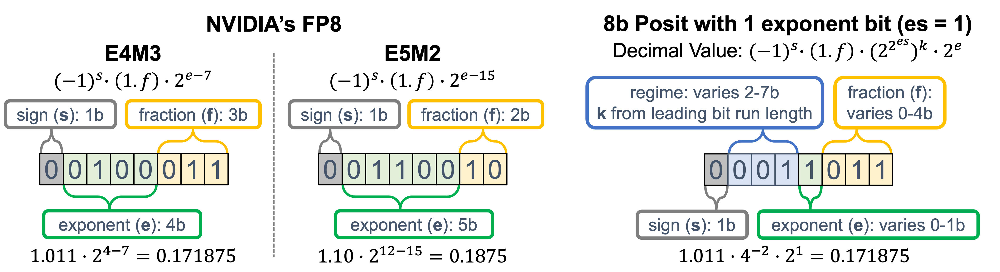

# 8-bit Transformer Inference and Fine-Tuning for Edge Accelerators
[[Paper](https://dl.acm.org/doi/10.1145/3620666.3651368)][[Slides](https://drive.google.com/file/d/16v3UhnWab2K_1wiDTYgXy1ZUNN-hCi7M/view?usp=sharing)][[Video](https://www.youtube.com/watch?v=lqW-8MQ2uFw)]

**Efficient and accurate** quantization for Transformers and CNNs, supporting **activation, weight, and gradient** quantization to **integer, floating-points, and posit** data types.



The current release supports:

- **Quantization for Custom Models:** Provides flexibility by allowing users to add their own model implementations for quantization.
- **Quantization Data Types:** Supports integer with arbitrary bit width, FP8 (E4M3 and E5M2), FP6 (E3M2 and E2M3), FP4 (E2M1), and posit with customizable nbits and es.
- Examples on Google MobileBERT and RoBERTa fine-tuning on GLUE and SQuAD question answering task.

## News
- [2024/02] 🔥 Our paper has been accepted to **ASPLOS 2024**!

## Content

- [8-bit Transformer Inference and Fine-Tuning for Edge Accelerators](#8-bit-transformer-inference-and-fine-tuning-for-edge-accelerators)
  - [News](#news)
  - [Contents](#contents)
  - [Prerequisites](#prerequisites)
  - [Quickstart](#quickstart)
  - [Results on SQuAD Question Answering](#results-on-squad-question-answering)
  - [Results on Large Language Models (GPT-2 and LLaMA 2)](#results-on-large-language-models-gpt-2-and-llama-2)
  - [Fine-Tuning Experiments](#fine-tuning-experiments)
  - [Reference](#reference)

## Prerequisites

- **Python Version:** Python 3.9 or newer.
- **PyTorch:** Version 2.3 or newer.

## Quickstart

1. Clone this repository and navigate to quantized-training folder
```bash
git clone https://github.com/jeffreyyu0602/quantized-training.git
cd quantized-training
```

2. Install Package
```bash
conda create -n qt python=3.9
conda activate qt
pip install -r requirements.txt
pip install -e .
```

3. Create an argument parser and add relevant quantization arguments by calling add_qspec_args.

```python
import argparse
from quantized_training import add_qspec_args

parser = argparse.ArgumentParser()
parser.add_argument('--model_id', type=str, required=True, help='Pretrained model identifier')
add_qspec_args(parser)
args= parser.parse_args()

```

4. Initialize model and call quantizer on the model with parsed arguments.
```python
from transformers import AutoModel
from quantized_training import quantize

model = AutoModel.from_pretrained(model_id)

quantize(model, args)
```

Your model is now quantized and ready for training or inference. For more use cases, please refer to the `example` folder for guidelines and examples on how to extend the functionality of Quantized-Training.

## Results on SQuAD Question Answering

To reproduce the Table 1 results in the paper, run
```python
python examples/question_answering/run_squad.py --log_file logs/squad.log --out_file squad
```
The outputs are stored in squad_f1.csv and should have the following format:

| Model                      | No Fusion     || GEMM + Attention Scaling || + Activation Fusion || + LayerNorm Fusion || + Residual Fusion ||
|----------------------------|:------:|:-----:|:------:|:----------------:|:------:|:-----------:|:------:|:----------:|:------:|:---------:|
|                            | Posit8 | E4M3  | Posit8 | E4M3             | Posit8 | E4M3        | Posit8 | E4M3       | Posit8 | E4M3      |
| MobileBERT<sub>tiny</sub>  | 86.3   | 87.0  | 87.4   | 87.1             | 87.7   | 87.5        | 87.9   | 87.8       | 88.4   | 88.1      |
| MobileBERT                 | 65.1   | 82.7  | 85.0   | 84.9             | 88.3   | 86.7        | 89.0   | 87.9       | 89.4   | 88.6      |
| DistillBERT<sub>base</sub> | 86.2   | 86.1  | 86.4   | 86.1             | 86.7   | 86.4        | 86.7   | 86.5       | 86.7   | 86.5      |
| BERT<sub>base</sub>        | 87.1   | 87.7  | 88.1   | 88.0             | 88.1   | 88.0        | 88.1   | 88.0       | 88.1   | 88.0      |
| BERT<sub>large</sub>       | 92.3   | 93.0  | 92.8   | 93.1             | 93.0   | 93.1        | 93.0   | 93.2       | 93.1   | 93.1      |

## Results on Large Language Models (GPT-2 and LLaMA 2)

To run LLaMA 2, you need to first request access to models checkpoint on the [huggingface](https://huggingface.co/meta-llama/Llama-2-7b-hf) website. Then login to your huggigface account in the terminal using [huggingface cli](https://huggingface.co/docs/huggingface_hub/en/guides/cli). After the request has been granted, you will be able to run LLaMA 2 on WikiText-103:
```python
python examples/language_modeling/wikitext.py --model_id meta-llama/Llama-2-13b-hf --max_length 1024 --stride 512
```

| Model         | Data Type   | No Fusion     | GEMM + Attention Scaling | + Activation Fusion | + LayerNorm Fusion | + Residual Fusion |
|---------------|-------------|:-------------:|:------------------------:|:-------------------:|:------------------:|:-----------------:|
| LLaMA 2 (7B)  | Posit(8, 1) | 5.56 | 5.53 | 5.53 | 5.52 | 5.30 |
| LLaMA 2 (7B)  | Posit(8, 2) | 5.44 | 5.40 | 5.38 | 5.37 | 5.29 |
| LLaMA 2 (7B)  | E4M3        | 5.80 | 5.80 | 5.77 | 5.75 | 5.36 |
| LLaMA 2 (13B) | Posit(8, 1) | 4.85 | 4.78 | 4.78 | 4.77 | 4.72 |
| LLaMA 2 (13B) | Posit(8, 2) | 4.86 | 4.82 | 4.81 | 4.80 | 4.72 |
| LLaMA 2 (13B) | E4M3        | 5.10 | 5.09 | 5.07 | 5.06 | 4.73 |

## Fine-Tuning Experiments

In our paper, we conducted fine-tuning experiments on four GLUE tasks (MNLI, SST-2, MRPC, and QNLI) and SQuAD v1.1 question answering task. All commands required to reproduce the results in Table 4 are provided in the script `asplos_training.sh`. The experiments are organized into groups, each addressing give tasks of different data types and configurations. Outputs from the experiments are recorded in their respective log files. We recommend starting with the MRPC task, as it is the shortest and typically completes in around an hour on an RTX 4090 GPU.

## Reference

If you find AWQ useful or relevant to your research, please kindly cite our paper:

```
@inproceedings{yu20248bit,
title = {8-bit Transformer Inference and Fine-tuning for Edge Accelerators},
author = {Yu, Jeffrey and Prabhu, Kartik and Urman, Yonatan and Radway, Robert M. and Han, Eric and Raina, Priyanka},
year = {2024},
url = {https://doi.org/10.1145/3620666.3651368},
doi = {10.1145/3620666.3651368},
booktitle = {Proceedings of the 29th ACM International Conference on Architectural Support for Programming Languages and Operating Systems, Volume 3},
}
```
